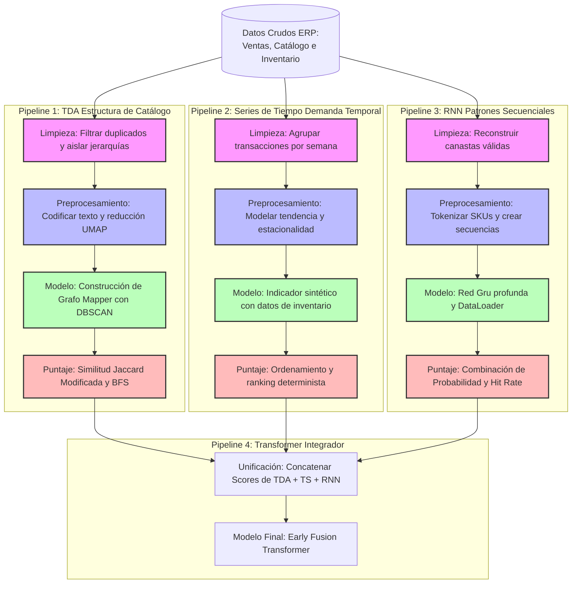

# Motor de Recomendación ANA-03: Cross-selling (Afinidad de Canasta)

Este repositorio contiene la implementación del pipeline de datos y modelado utilizando **Kedro** para el caso de uso *ANA-03 Cross-selling (Afinidad de Canasta)* para la plataforma TCA Merksyst. La solución implementa una arquitectura híbrida que extrae y unifica tres señales principales por SKU (TDA, Series de Tiempo y RNN) para entrenar un modelo final basado en un **Early Fusion Transformer**.

---

## 🔄 Flujo General y Conexión de los Pipelines

El proyecto funciona bajo un enfoque **híbrido**. No se apoya en una sola técnica, sino que procesa los datos transaccionales de ventas del ERP a través de **tres pipelines independientes** (TDA, Series de Tiempo y RNN). Cada uno de ellos extrae una "señal" o puntaje (*score*) diferente para cada artículo (SKU).

Finalmente, un **cuarto pipeline (el Transformer)** actúa como el embudo integrador: une (*merge*) los puntajes de los tres pipelines anteriores y entrena el modelo definitivo que ordenará las recomendaciones de productos para el vendedor.



---

## 📊 Desglose de las Etapas por Técnica

### 1. Topological Data Analysis (TDA)
*Su objetivo es entender qué productos son parecidos según su clasificación en el catálogo (línea, familia, subfamilia).*
* **Limpieza:** Toma el catálogo y elimina cualquier redundancia o registro duplicado para quedarse con la estructura jerárquica exacta de los SKUs.
* **Preprocesamiento:** Convierte las categorías de texto en números enteros (`LabelEncoder`) y reduce la dimensionalidad de miles de artículos a un plano matemático manejable de solo 2 dimensiones usando las técnicas Isomap y UMAP.
* **Modelo:** Agrupa los productos en este nuevo plano usando el algoritmo **DBSCAN** y crea un mapa interconectado (Grafo Mapper) que revela qué familias de artículos están físicamente "cerca" entre sí.
* **Puntaje:** Evalúa la cercanía de un artículo con respecto a los productos de la canasta usando una versión modificada del Índice de Jaccard. Si no se tocan directamente, mide los pasos que le toma llegar a él en el grafo (Búsqueda en Anchura - BFS). Genera una tabla ordenada de afinidad topológica.

### 2. Series de Tiempo (TS)
*Su objetivo es calificar los productos según su comportamiento en el tiempo (tendencia, estacionalidad, recencia) y si hay stock disponible.*
* **Limpieza:** Agrupa las ventas diarias del ERP en periodos semanales balanceados. En esta técnica sí se conservan los tickets de un solo artículo, ya que representan demanda real.
* **Preprocesamiento:** Descompone analíticamente la señal de ventas para aislar y normalizar matemáticamente los componentes de tendencia, volumen, recencia y estacionalidad.
* **Modelo:** Integra la información física del inventario (si el producto cuenta con existencias para ser vendido o no) junto con los componentes temporales previamente calculados.
* **Puntaje:** Construye un indicador unificado temporal determinista (`score_TS`), ordenando los SKUs de mayor a menor prioridad según la oportunidad comercial y de disponibilidad.

### 3. Red Neuronal Recurrente (RNN)
*Su objetivo es aprender el orden y la secuencia en que la gente suele meter los productos al carrito de compras en el histórico real.*
* **Limpieza:** Reconstruye las canastas uniendo los encabezados y detalles de venta, aplicando filtros estrictos (solo ventas reales, eliminar devoluciones, cantidades menores a cero y descartar carritos con menos de 3 productos).
* **Preprocesamiento:** Genera un vocabulario indexado donde a cada artículo se le asigna un número identificador único y se rellenan las secuencias con un token de control (`<PAD>`) para que todas tengan la misma longitud. Divide los datos de forma aleatoria en conjuntos de entrenamiento y validación.
* **Modelo:** Entrena una arquitectura profunda basada en unidades recurrentes **GRU** (`BasketGRU`) utilizando un cargador asíncrono de datos (`DataLoader`) de PyTorch. El modelo intenta adivinar cuál es el "siguiente artículo" de la secuencia.
* **Puntaje:** Al evaluar el comportamiento de la red, combina tres métricas: la probabilidad neta que la red asignó a cada artículo (40%), la consistencia con la que acertó en primer lugar (35%) y su aparición en el Top 5 (25%). El resultado es un valor de preferencia secuencial continuo entre 0 y 1.

### 4. Transformer (El Pipeline Integrador)
*Su objetivo es fusionar las tres señales anteriores y entrenar el recomendador final de la aplicación.*
* **Limpieza / Unificación:** Hace un cruce por la izquierda (`LEFT JOIN` / `outer MERGE`) combinando los scores resultantes de TDA, Series de Tiempo y RNN utilizando la clave única del artículo (`cve_art`). Si a un artículo le falta alguna de las señales, se le asigna un cero y se normaliza el total.
* **Preprocesamiento:** Genera un índice de vocabulario unificado y prepara las canastas históricas con ventanas deslizantes de un paso hacia adelante para alimentar el modelo.
* **Modelo Final:** Toma las canastas y proyecta los scores consolidados en capas densas (ReLU) fusionándolos directamente con el identificador del producto dentro de un `EarlyFusionTransformer`.
* **Salida de Puntaje:** El Transformer genera la distribución final de probabilidad para la canasta activa, aislando las mejores alternativas en un ordenamiento descendente (Top-K) que se envía directo a la API de producción.

---

## 🚀 Instrucciones de Ejecución

Debido a la naturaleza arquitectónica del Transformer de fusión temprana y al uso de variables temporales y dinámicas intermedias, **se requiere ejecutar el pipeline en conjunto** empleando parámetros específicos para asegurar la persistencia en memoria:

```bash
# Ejecución integral de pipelines hasta el entrenamiento del Transformer
kedro run -p transformer_training
```
Fuera de esto los otros pipelines deberian de ser por su nombre con el cual se corre el pipeline. 
NOTA: Es necesario hacer los pipelines de TDA, RNN y TS antes que el transformer para su debido funcionamiento.

## Recomendaciones

Usar uv para la instalación de requirimientos.

```bash
#Instalar uv en el ambiente virtual
pip install uv

# Instalar dependencias
uv pip install -r requirements.txt
```
